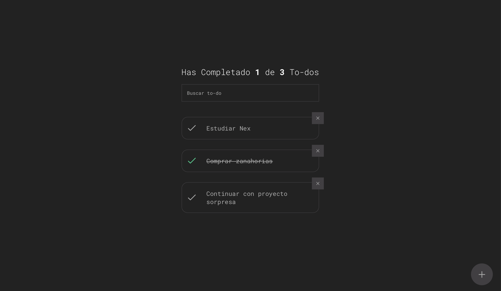

# To-do app

This project was created with React and the LocalStorage API to store the information.




## Built With 🚀

* [![React][React.js]][React-url]


## Getting started  🔧

Clone the repository

```sh
npm clone https://github.com/mauricioyair/To-do.git
```

Install dependency
```sh
npm install
```

In the project directory, you can run:

```sh
npm start
```

Runs the app in the development mode.\
Open [http://localhost:3000](http://localhost:3000) to view it in your browser.

The page will reload when you make changes.\
You may also see any lint errors in the console.

Or watch the live [demo](https://mauricioyair.github.io/To-do)


[React.js]: https://img.shields.io/badge/React-20232A?style=for-the-badge&logo=react&logoColor=61DAFB
[React-url]: https://github.com/facebook/create-react-app